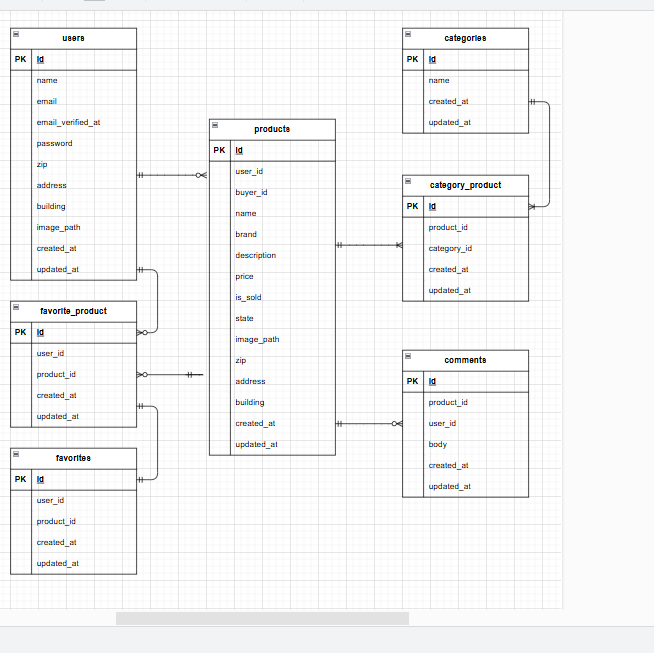

# 「coachtechフリマ」

このアプリはテスト課題としてLaravel 8で開発したフリマアプリです。10～30代の社会人をターゲットとし、PCでの使用を前提とし開発しました。  

## 実装済み機能一覧

- 会員登録・ログイン（メール認証対応）
- プロフィール編集（画像・住所など）
- 商品出荷（画像アップロード・複数カテゴリ対応）
- 商品一覧・詳細ページ（カード表示・いいね・コメント）
- Stripeによる購入決済（配送先変更も可能）
- マイページ（出品・購入商品一覧）
- 商品検索・マイリスト表示
- 管理機能（バリデーション・テストコード）

## dockerビルド

1. リポジトリのクローン  

    git clone git@github.com:tomo1583gh/coachtech-flea-market.git  

2. Dockerコンテナのビルド・起動  

    docker-compose up -d --build  

    ※  Mysqlは、OSによって起動しない場合があるのでそれぞれのPCに合わせてdocker-compose.ymlファイルを編集して下さい。

## laravel環境構築

1. PHPコンテナに入る

    docker-compose exec php bash

2. Composerで依存パッケージをインストール

    composer install

3. .env.exampleファイルをコピーして.envファイルを作成し環境変数を変更

4. アプリケーションキーを生成

    php artisan key:generate

5. マイグレーションを実行

    php artisan migrate

6. 初期データを投入

    php artisan db:seed

7. シンボリックリンクの作成

    php artisan storage:link

8. Mailhog起動（別途インストール必要）

    環境変数を変更後http://localhost:8025 でメール確認可能

9. StripeのSTRIPE_KEY(公開鍵)とSTRIPE_SECRET（秘密鍵）を.envファイルに設定

10. アプリ起動

    php artisan serve

## 使用技術

- php 8.2.12

- laravel 8.83.29

- Mysql 8.0.26

- Fortify【認証機能】

- Mailhog【メール確認】

- Stripe【支払い処理】

- Blade + CSS

## URL

- 開発環境：http://localhost:8000

- phpMyAdmin:http://localhost:8080

- Mailhog:http://localhost:8025

- Stripe:https://dashboard.stripe.com/test

## ER図

## テストユーザーについて

アプリ起動後、Seederにより自動でテストユーザーが作成されます。  
ログインや購入機能の動作確認にご利用ください。

### ログイン情報（ダミーユーザー）

メールアドレス：test@example.com
パスワード：password